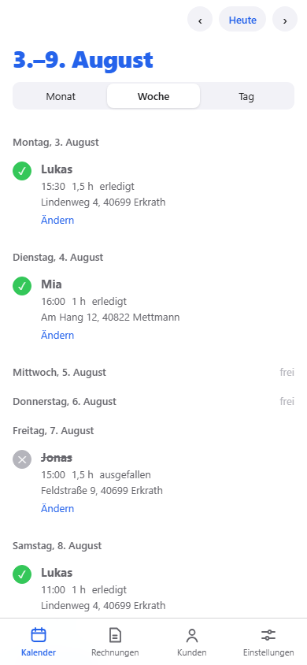
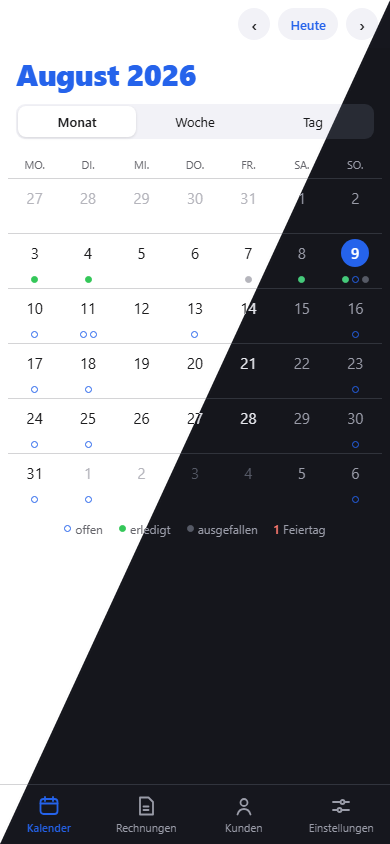
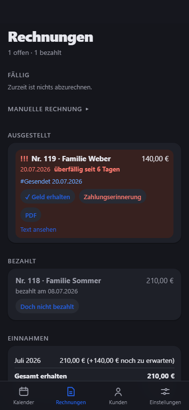
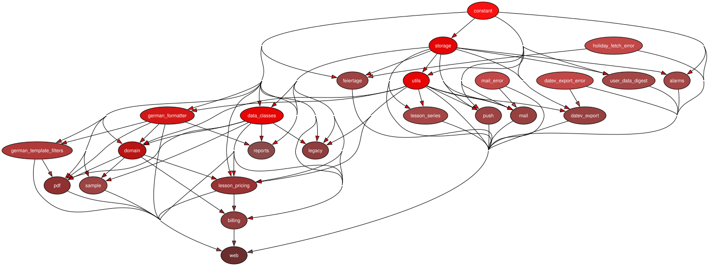

# Rechnungsersteller

A self-hosted web app for tutors: tick lessons off in a calendar, turn them
into PDF invoices and send them by e-mail or WhatsApp. Built for the phone —
as an app on the home screen — and just as usable on a desktop. The
interface is German, as are the invoices it produces.

## What it does

- **Calendar** in month, week and day views, with recurring series, public
  holidays and school holidays
- **Alarm clock**: the app itself sends push notifications before every
  lesson and keeps ringing every two minutes until answered
- **Invoices** grow out of the ticked-off lessons — automatically at each
  customer's billing day or manually for any stretch of days, with a
  gap-free invoice number sequence
- **Sending** by e-mail (with a copy in the mailbox's Sent folder) or
  WhatsApp, payment reminders with a per-customer letter
- **Earnings** by month: received, still expected, and never invoiced —
  plus a ZIP per year for the tax office and a DATEV booking batch per year
  for Lexware. The ZIP goes by the year the money arrived, the booking batch
  by the year on the invoice, because it is the outgoing invoice ledger
- **Import** of old Word invoices as history

Everything lives in a single SQLite file on your own server, behind one
password; nothing leaves your machine.

## Screenshots

From day to night: the app follows the phone, or the switch in the
settings. All data invented.

<p>
  
  
  
</p>

## Running your own

Every installation belongs to one person: your server, your database, your
password. You need a small Ubuntu VPS (the cheapest tier is enough) and a
(sub)domain — HTTPS is mandatory, because push notifications and the
home-screen app require it.

The full path from a fresh machine to a running app is in
[deploy/README.md](deploy/README.md); in short:

```powershell
.\deploy\upload.ps1 -Server root@YOUR.SERVER.IP
ssh root@YOUR.SERVER.IP
cd /opt/invoicing && INVOICING_DOMAIN=invoices.your-domain.com bash deploy/install.sh
```

To try it without a server, the app also runs locally:

```bash
uv sync
uv run python main.py set-password 'A-PASSWORD'
uv run python main.py serve
```

## How it is built

FastAPI and SQLModel over SQLite, Alembic migrations on startup, PDFs from
HTML through WeasyPrint (Linux) or Chromium (Windows), web push with its
own VAPID key. One module per job:



## Developing

```bash
uv sync
uv run pytest
```

Before every commit the chain from
[.pre-commit-config.yaml](.pre-commit-config.yaml) runs: pytest, black,
ruff, radon, skylos, complexipy, pydeps and pyright.

## License

MIT — see [LICENSE](LICENSE).
